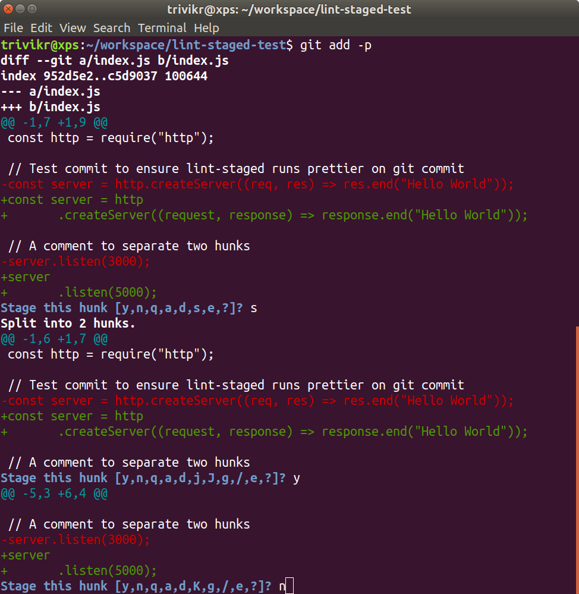
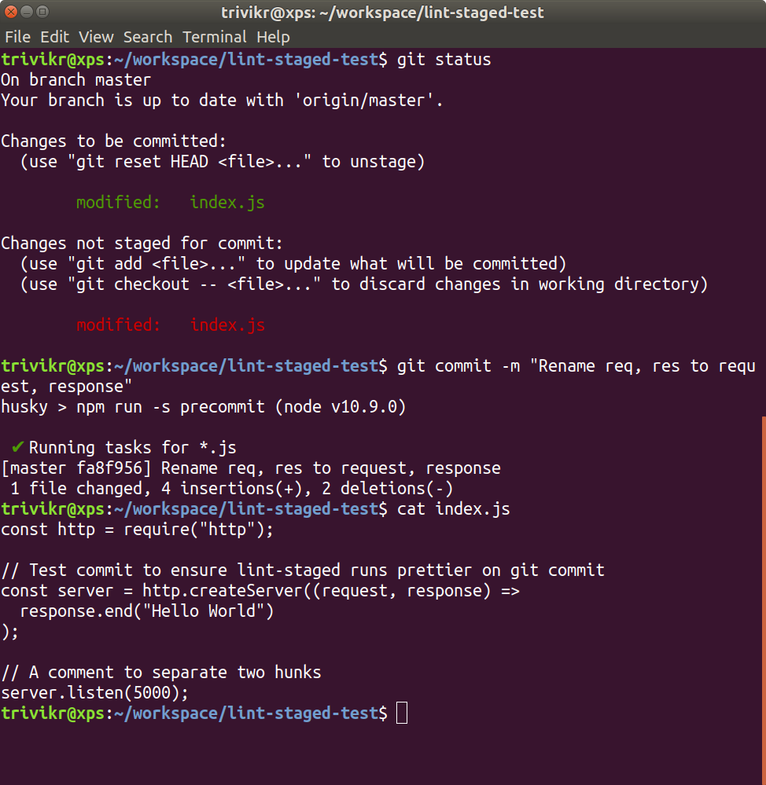
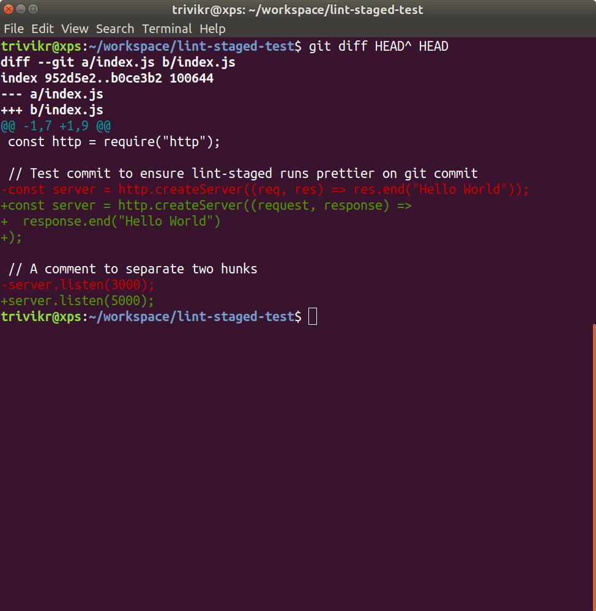

# lint-staged-test
Confirming that lint-staged has an issue working with `git add -p`, verified as follows:

* Edited index.js to make two changes:
  * Rename `req` and `res` to `request` and `response`
  * Change port from `3000` to `5000`
* Ran `git add -p` to split to two hunks
  
* Ran `git commit -m "<MSG>"` to add first hunk to commit msg, which ran lint-staged and prettier
  
* Notice that both hunks were added, and unstaged changes are also part of commit
  